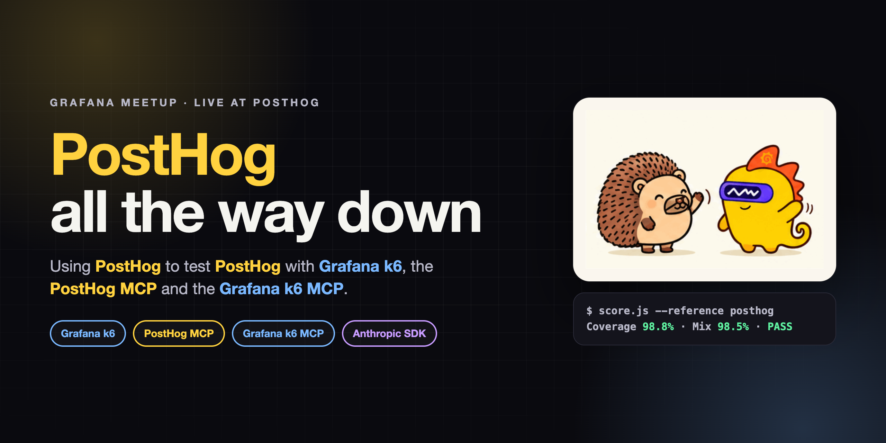
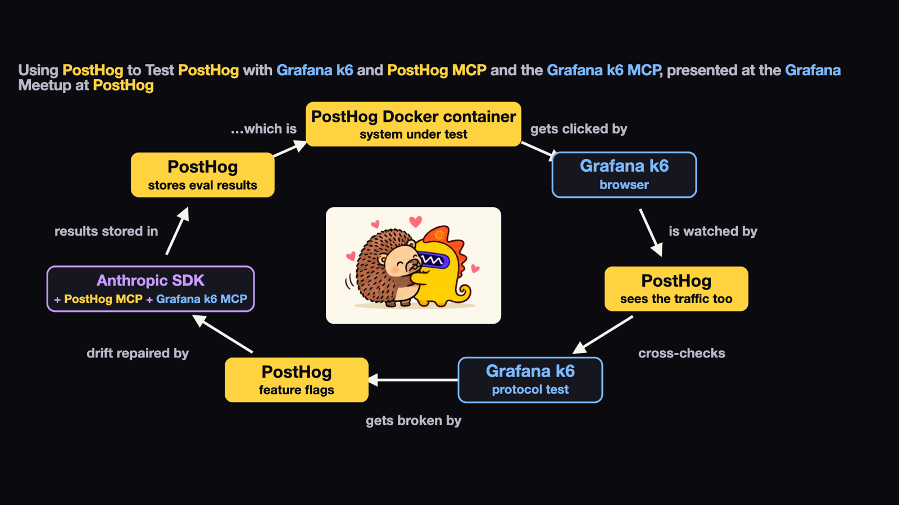
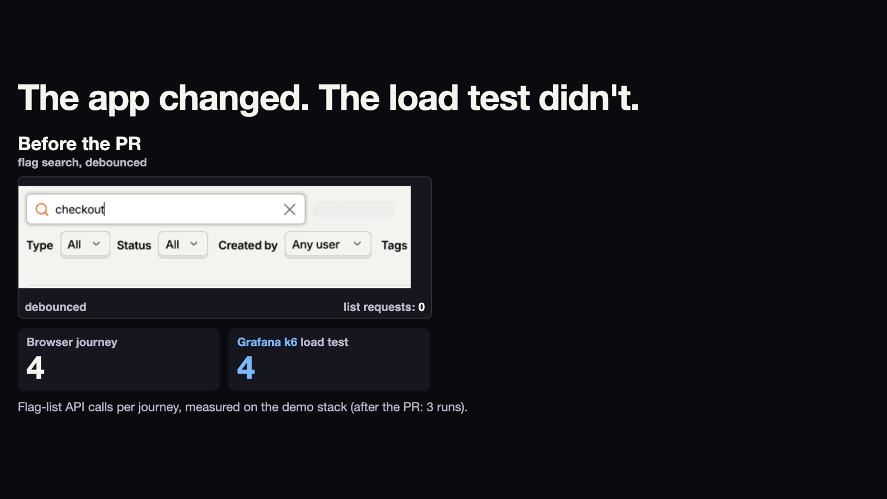
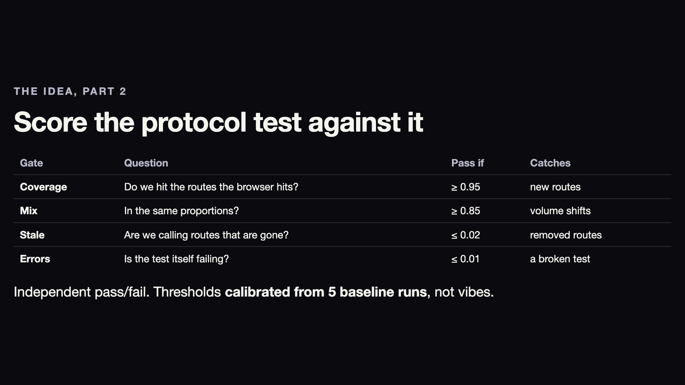
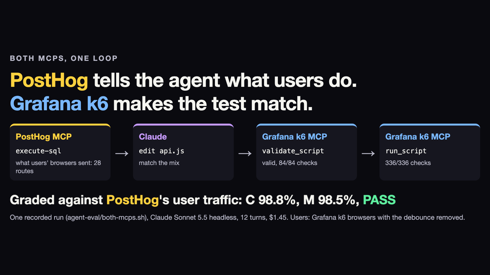
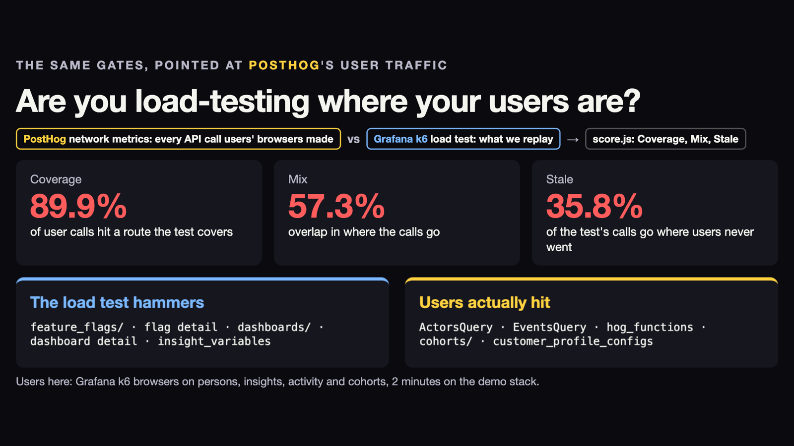
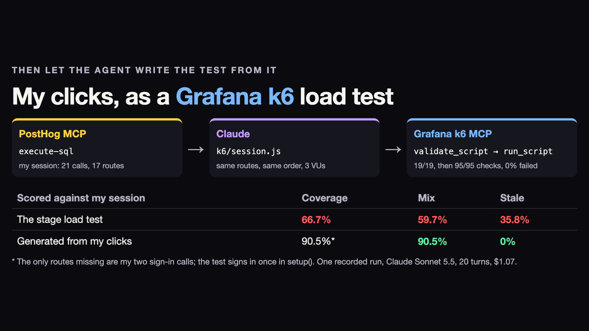

<p align="center">
  
</p>

<p align="center">
  <a href="https://grafana.com/docs/k6/latest/"></a>
  <a href="https://posthog.com/docs/model-context-protocol"></a>
  <a href="https://github.com/grafana/mcp-k6"></a>
  <a href="https://docs.anthropic.com/en/docs/claude-code"></a>
  <a href="LICENSE"></a>
</p>

<p align="center">
  <b>Your load test is a snapshot of how the frontend behaved the day you wrote it.<br>
  This repo notices when that snapshot goes stale, and has an agent fix it.</b>
</p>

<p align="center">
  <a href="#-the-loop">The loop</a> ·
  <a href="#-the-gates">The gates</a> ·
  <a href="#-both-mcps-one-loop">Both MCPs</a> ·
  <a href="#-quickstart">Quickstart</a> ·
  <a href="#-the-talk">The talk</a>
</p>

---

A **Grafana k6 protocol test** is a cached model of browser behavior. Ship a frontend change (drop a
debounce, add an N+1) and the browser starts sending different API traffic, but the load test keeps
replaying the old mix. Nothing fails. You just stop load-testing what your users actually do.

This project, built for a talk at the **Grafana Meetup at PostHog**, closes that gap on a live
self-hosted PostHog:

1. **Grafana k6 browser** clicks through the real PostHog UI and records every API call.
2. **PostHog** watches the same traffic through its own network metrics.
3. **`score.js`** grades the **Grafana k6 protocol test** against it on four calibrated gates.
4. When a PostHog **feature flag** ships a drift, the gates fail and name the route.
5. An agent on the **Anthropic SDK** asks the **PostHog MCP** what users sent, rewrites the test, and
   proves it through the **Grafana k6 MCP**.
6. The eval results go back into **PostHog**, which is the system under test. It's PostHog all the
   way down.

## 🔁 The loop

<p align="center"></p>

## 🚦 The gates

<table>
<tr>
<td width="50%"></td>
<td width="50%"></td>
</tr>
</table>

Four independent pass/fail gates, with thresholds **calibrated from 5 baseline runs** (DESIGN.md §5.2):

| Gate | Question | Baseline runs | Worst | Pass if |
|---|---|---|---|---|
| **Coverage** C | Do we hit the routes the browser hits? | 0.964 0.965 0.964 0.966 0.964 | 0.964 | ≥ 0.95 |
| **Mix** M | In the same proportions? | 0.931 0.915 0.931 0.900 0.931 | 0.900 | ≥ 0.85 |
| **Stale** E | Are we calling routes that are gone? | 0 0 0 0 0 | 0 | ≤ 0.02 |
| **Errors** | Is the test itself failing? | 0 0 0 0 0 | 0 | ≤ 0.01 |

The seeded drifts fail exactly the gates they should:

| Drift (PostHog feature flag) | Coverage | Mix | Result |
|---|---|---|---|
| `meetup-no-debounce`: flag search fires a request per keystroke | 0.977 | **0.762** | ❌ fails Mix only |
| `meetup-n-plus-one`: an activity call per flag row | **0.589** | | ❌ fails Coverage, names `GET /api/projects/:id/feature_flags/:id/activity/` |

## 🤝 Both MCPs, one loop

<p align="center"></p>

`agent-eval/both-mcps.sh` hands a stale `k6/api.js` to a headless agent with two MCP servers and
nothing else. The agent calls the **PostHog MCP** `execute-sql` to see what users' browsers sent,
edits the script, then runs **Grafana k6 MCP** `validate_script` and `run_script`. It's then graded
against PostHog's user traffic with `score.js --reference posthog`.

> **One recorded run:** Coverage **98.8%**, Mix **98.5%**, ✅ **PASS**. Claude Sonnet 5.5, 12 turns, $1.45.

## 🎯 Are you load-testing where your users are?

<table>
<tr>
<td width="50%"></td>
<td width="50%"></td>
</tr>
</table>

In production, PostHog's network metrics record what **real users'** browsers send, so they can
replace the Grafana k6 browser as the reference:

```bash
node eval/score.js --reference posthog --since 60m --protocol out/protocol-p1.json
```

Point it at a session where you click around the app yourself, and the agent turns your clicks into
[`k6/session.js`](k6/session.js). That test passes `validate_script` (19/19 checks) and `run_script`
(95/95 checks, 0% failed) through the Grafana k6 MCP. The stage load test scored C 66.7% / M 59.7%
against the session; the generated test scores **C 90.5% / M 90.5% / Stale 0%**. The only routes it
misses are the two sign-in calls, which it makes once in `setup()`.

## ⚡ Quickstart

**No stack needed:**

```bash
node eval/score.js --selftest && node agent-eval/report.js --selftest
./demo.sh check   # asserts the offline pass/fail pattern from seeded fixtures
```

<details>
<summary><b>Full stack: self-hosted PostHog with the meetup drift flags</b></summary>

PostHog's hobby compose at the pinned SHA, plus `posthog/docker-compose.override.yml`:

```bash
docker pull posthog/posthog:sha-54c04a0f494dc0821b87e95c19dcade17a633591
docker pull ghcr.io/posthog/posthog-node:6bcb56fb6e5ff2200852f2080339050d32b98d20
docker tag ghcr.io/posthog/posthog-node:6bcb56fb6e5ff2200852f2080339050d32b98d20 posthog/posthog-node:meetup
# Build frontend/dist with PostHog's own Dockerfile stage, from a checkout at the pinned SHA
# with posthog/frontend.patch applied, and copy it to posthog/dist/:
#   (cd <posthog-checkout> && git apply <this-repo>/posthog/frontend.patch \
#     && docker build --target frontend-build -t posthog-meetup-frontend .)
#   docker cp "$(docker create posthog-meetup-frontend)":/code/frontend/dist posthog/dist
docker build --build-arg POSTHOG_SHA=54c04a0f494dc0821b87e95c19dcade17a633591 -t posthog-meetup:local posthog/
# Fast path without a frontend build: -f posthog/Dockerfile.hotpatch applies the same changes to the built JS.
POSTHOG_NODE_TAG=meetup docker compose -f docker-compose.hobby.yml -f docker-compose.override.yml up -d
```

Then generate traffic and score it (`PH_EMAIL` / `PH_PASSWORD`: the local test user; `BASE_URL`: the stack):

```bash
RUN_ID=b1 TERM=checkout k6 run --out json=out/browser-b1.json k6/journey.js
RUN_ID=p1 k6 run --out json=out/protocol-p1.json k6/api.js
node eval/score.js --ref out/browser-b1.json --protocol out/protocol-p1.json --run-id b1
```

</details>

<details>
<summary><b>Demo and agent commands</b></summary>

| Command | What it does |
|---|---|
| `./demo.sh baseline\|no-debounce\|n-plus-one\|repaired` | Runs one stage live; falls back to seeded fixtures (`eval/fixtures.js`) if the stack fails or takes over 60 s |
| `./demo.sh users [15m]` | Scores the stage protocol run against every session PostHog recorded in the window |
| `agent-eval/both-mcps.sh [flag]` | The both-MCPs loop: PostHog MCP → edit → Grafana k6 MCP validate and run → graded against PostHog |
| `agent-eval/run.sh [trials]` | The agent eval: tasks × with/without the Grafana k6 MCP × trials, held-out grading |
| `node k6/bundle.js <script>` | Inlines local imports so the Grafana k6 MCP can run a multi-file script |

The agent commands need `mcp-k6` (`brew install mcp-k6` from the `grafana/grafana` tap) and `claude`.

</details>

## 🗺️ What's in here

| Path | |
|---|---|
| [`eval/score.js`](eval/score.js) | The grader: Coverage, Mix, Stale, Errors, against a browser run or PostHog's own metrics |
| [`k6/`](k6/) | `journey.js` (Grafana k6 browser), `api.js` (protocol test), `session.js` (generated from real clicks), `bundle.js` |
| [`agent-eval/`](agent-eval/) | The agent eval harness and the both-MCPs loop |
| [`posthog/`](posthog/) | The frontend patch with the two drift flags, plus the image and compose overrides |
| [`slides/a/`](slides/a/) | The deck, in reveal.js. Serve it with `python3 -m http.server -d slides 8766` |
| [`DESIGN.md`](DESIGN.md) | The build spec. Start with §9, the verification checklist |
| [`TALK.md`](TALK.md) | The talk outline |

## 🎤 The talk

**Using PostHog to Test PostHog with Grafana k6 and PostHog MCP and the Grafana k6 MCP**, presented at
the Grafana Meetup at PostHog.

```bash
python3 -m http.server -d slides 8766   # then open http://127.0.0.1:8766/a/
```

The mascot counters fall back to emoji: `slides/mascots/` is gitignored until PostHog and Grafana
approve their use.

## 📜 License

MIT, see [LICENSE](LICENSE). `posthog/frontend.patch` contains code from PostHog, Inc., also under
the MIT license; see [NOTICE](NOTICE). Never publish the built Docker image: it includes PostHog's
`ee/` code, which may not be redistributed.

<p align="center"><sub>Not affiliated with PostHog or Grafana Labs. Just standing in their office.</sub></p>
